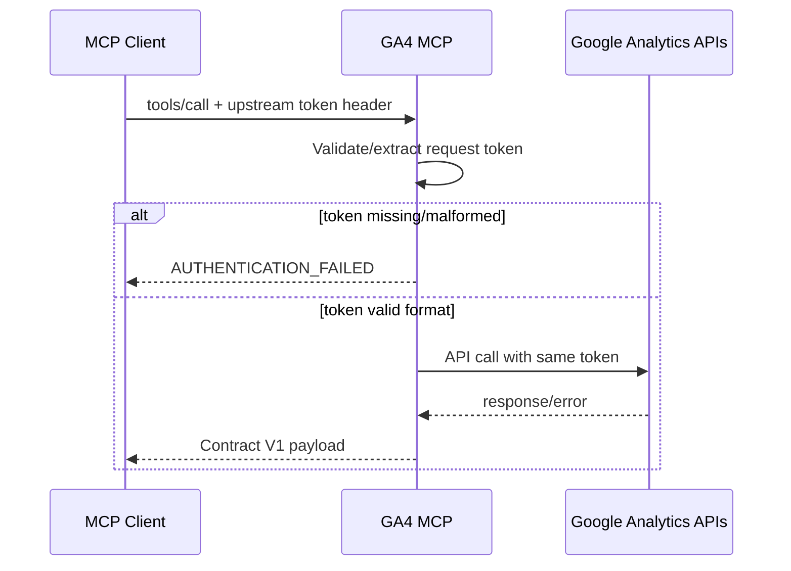

# GA4 MCP Auth Modes

This guide explains GA4 MCP auth in plain language.

## The Two Doors

There are two separate auth decisions:

1. `Inbound MCP auth`: who can call your MCP server.
2. `Upstream Google auth`: which Google identity is used when calling GA4 APIs.

Most confusion happens when these two are mixed together.

## The Straight Answer

Use exactly one of these defaults unless you have a specific reason not to:

- **Local user service**: `request_header_or_config`.
  Log in once with Google ADC, then local clients do not need to pass bearer
  tokens. This is the recommended path for a loopback developer/operator
  service.
- **Hosted or public service**: `request_header`.
  The server must not silently act as one shared Google user. Each client sends
  its own Google access token.
- **Automation service**: `config`.
  The service intentionally owns the Google identity through ADC, a service
  account, or OAuth refresh-token settings.

Generic local setup:

```bash
ga4-mcp auth login
ga4-mcp auth status --verify-token

export GOOGLE_ANALYTICS_MCP_UPSTREAM_TOKEN_SOURCE=request_header_or_config
export GOOGLE_ANALYTICS_MCP_UPSTREAM_TOKEN_HEADER=authorization
```

If you are on SSH or a headless box, use:

```bash
ga4-mcp auth login --headless
```

The CLI prints the underlying `gcloud` command, then `gcloud` prints a URL and
waits for browser consent from a trusted machine.

If Google blocks the default client for Analytics scopes, create a Google OAuth
desktop client, save its JSON outside the repository, and rerun with
`ga4-mcp auth login --client-id-file /path/to/oauth-client.json`.

If Google says local ADC needs a quota project, enable the Analytics APIs on a
Google Cloud project and attach that project to ADC:

```bash
gcloud services enable analyticsadmin.googleapis.com analyticsdata.googleapis.com --project YOUR_PROJECT
gcloud auth application-default set-quota-project YOUR_PROJECT
ga4-mcp auth status --verify-token
```

## Quick Mode Matrix

| Goal | Inbound MCP auth | Upstream Google auth | Key settings |
|---|---|---|---|
| Per-user Google login (recommended for hosted agents) | Off | Request token from client | `GA4_MCP_AUTH_ENABLED=0`, `GOOGLE_ANALYTICS_MCP_UPSTREAM_TOKEN_SOURCE=request_header`, `GOOGLE_ANALYTICS_MCP_UPSTREAM_TOKEN_HEADER=authorization` |
| Extra boundary + per-user Google login | On (`jwks`/`introspection`) | Request token from client | `GA4_MCP_AUTH_ENABLED=1`, `GOOGLE_ANALYTICS_MCP_UPSTREAM_TOKEN_SOURCE=request_header` with non-conflicting header |
| Local user-level service | Off on loopback | Header first, local ADC fallback | `GA4_MCP_BIND_ADDR=127.0.0.1:9420`, `GOOGLE_ANALYTICS_MCP_UPSTREAM_TOKEN_SOURCE=request_header_or_config` |
| Internal automation with server identity | Optional | Server-held credentials | `GOOGLE_ANALYTICS_MCP_UPSTREAM_TOKEN_SOURCE=config` |
| Migration period | Optional | Header first, then server fallback | `GOOGLE_ANALYTICS_MCP_UPSTREAM_TOKEN_SOURCE=request_header_or_config` |

## Upstream Google Auth Modes

Controlled by:

- `GOOGLE_ANALYTICS_MCP_UPSTREAM_TOKEN_SOURCE`
- `GOOGLE_ANALYTICS_MCP_UPSTREAM_TOKEN_HEADER`

### 1) `config`

Server acquires Google tokens itself (ADC or OAuth refresh-token settings).

- Pros: simplest for trusted service jobs.
- Cons: all users share server identity; not user-scoped.

### 2) `request_header`

Server requires a Google access token in request headers and uses that token upstream.

- Pros: true per-user access and permissions.
- Cons: client must manage OAuth flow and send token every call.

### 3) `request_header_or_config`

Server uses request token when present, otherwise falls back to server identity.

- Pros: smoother local user experience and migration path.
- Cons: accidental fallback can hide client auth issues; do not use as a public anonymous surface.

## Inbound MCP Auth Modes

Controlled by:

- `GA4_MCP_AUTH_ENABLED`
- `GA4_MCP_AUTH_MODE` (when enabled)

### `GA4_MCP_AUTH_ENABLED=0`

No inbound OAuth check by the MCP server. Access is controlled by network/TLS boundary.

### `GA4_MCP_AUTH_ENABLED=1`

The MCP server enforces OAuth for MCP requests.

- `jwks`: local JWT validation against issuer keys.
- `introspection`: remote token validation against issuer endpoint.
- `delegation`: delegated service token model (not a Google end-user login mode).

## Recommended Setup: Per-User Google Login

This is the correct model for hosted/public/multi-user MCP deployments. The
server does not own a shared Google identity; each client request carries the
Google identity that should be used upstream.

```bash
GA4_MCP_AUTH_ENABLED=0
GOOGLE_ANALYTICS_MCP_UPSTREAM_TOKEN_SOURCE=request_header
GOOGLE_ANALYTICS_MCP_UPSTREAM_TOKEN_HEADER=authorization
```

Client behavior:

- Client runs interactive Google OAuth.
- Client sends `Authorization: Bearer <google_access_token>` on MCP requests.
- Server uses that same token for GA4 API calls.

## Recommended Local Setup: Login Once With ADC

For a user-level service bound to loopback, the least painful setup is to let
the service use the local user's Google ADC credential when the client does not
send a bearer token.

```bash
ga4-mcp auth login
ga4-mcp auth status --verify-token

export GOOGLE_ANALYTICS_MCP_UPSTREAM_TOKEN_SOURCE=request_header_or_config
export GOOGLE_ANALYTICS_MCP_UPSTREAM_TOKEN_HEADER=authorization
```

Headless/SSH variant:

```bash
ga4-mcp auth login --headless
```

Configure the MCP process environment:

```bash
GOOGLE_ANALYTICS_MCP_UPSTREAM_TOKEN_SOURCE=request_header_or_config
GOOGLE_ANALYTICS_MCP_UPSTREAM_TOKEN_HEADER=authorization
```

Behavior:

- If the MCP client sends `Authorization: Bearer <google_access_token>`, that token is used.
- If the client does not send a token, the server uses ADC for the logged-in local user.
- Do not use this fallback on a public anonymous surface.

Verify the process environment is using the intended mode:

```bash
env | grep -E '^(GOOGLE_ANALYTICS_MCP_UPSTREAM_TOKEN_SOURCE|GOOGLE_ANALYTICS_MCP_UPSTREAM_TOKEN_HEADER)='
```

Expected env:

```bash
GOOGLE_ANALYTICS_MCP_UPSTREAM_TOKEN_SOURCE=request_header_or_config
GOOGLE_ANALYTICS_MCP_UPSTREAM_TOKEN_HEADER=authorization
```

If a tool call fails with `authentication bootstrap failed: no available
authentication method found`, ADC is not logged in yet. Run
`ga4-mcp auth login` again and complete browser consent as a Google account
that has GA4 access.

If a tool call fails with Google `403`, the Google login worked but that Google
identity does not have access to the requested GA4 account or property.

`--no-launch-browser` is the normal SSH-friendly path when the default `gcloud`
OAuth client works. With `--client-id-file`, current `gcloud` releases may use
remote-bootstrap mode; that mode expects another trusted machine with both a
browser and `gcloud`.

Google's limited-input device flow is not the right fallback for this GA4 MCP:
the documented device flow scope set is limited and does not include
`https://www.googleapis.com/auth/analytics.readonly`. Use a desktop OAuth
client JSON plus ADC instead.

## Copilot Studio OAuth Mapping

Use OAuth 2.0 manual configuration with a pre-registered Google OAuth client:

- Authorization URL: `https://accounts.google.com/o/oauth2/v2/auth`
- Token URL: `https://oauth2.googleapis.com/token`
- Scope: `https://www.googleapis.com/auth/analytics.readonly`

Google DCR note:

- For this pattern, use a pre-registered client ID/secret.
- Do not depend on generic dynamic client registration.

## Header Collision Warning (Dual-Boundary Setup)

If inbound MCP auth is enabled and you also need a separate upstream Google token:

- Do not reuse `authorization` for both roles unless your client can safely represent both.
- Prefer:
  - `GA4_MCP_AUTH_ENABLED=1` for MCP auth token handling
  - `GOOGLE_ANALYTICS_MCP_UPSTREAM_TOKEN_HEADER=x-google-access-token` for upstream Google token

## Request Flow



## Troubleshooting

### `AUTHENTICATION_FAILED` + `missing request access token in header ...`

Meaning:

- Server is in request-header mode, but client did not send token.

Fix:

- Ensure client OAuth completes and sends the expected header name.

### `AUTHENTICATION_FAILED` + `malformed request access token ...`

Meaning:

- Token header is present but malformed.

Fix:

- For `authorization`, use `Bearer <token>`.

### `UPSTREAM_REJECTED` + HTTP `401` from Google

Meaning:

- Token is invalid, expired, or not usable.

Fix:

- Re-run client OAuth and verify scope includes `analytics.readonly`.

### `UPSTREAM_REJECTED` + HTTP `403` with quota-project message

Meaning:

- Request is still using ADC/server identity without quota project.

Fix:

- If this is a hosted per-user service, confirm clients are sending request
  tokens and the server is in `request_header` mode.
- If using ADC or `request_header_or_config`, run
  `gcloud services enable analyticsadmin.googleapis.com analyticsdata.googleapis.com --project YOUR_PROJECT`
  and `gcloud auth application-default set-quota-project YOUR_PROJECT`, then
  rerun `ga4-mcp auth status --verify-token`.

### `UPSTREAM_REJECTED` + HTTP `403` without quota message

Meaning:

- Google identity lacks GA property/account permissions.

Fix:

- Grant the user access to the GA4 account/property.

### HTTP `400` with `Authorization headers are not accepted ...`

Meaning:

- Inbound auth is off and server is not in upstream request-header mode.

Fix:

- Set `GOOGLE_ANALYTICS_MCP_UPSTREAM_TOKEN_SOURCE=request_header` (or `request_header_or_config`).
